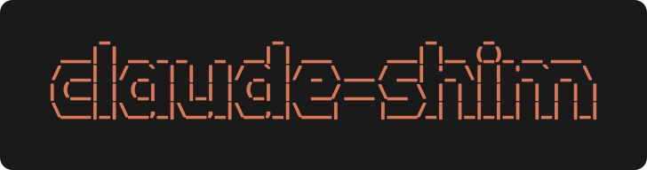

<div align="center">

<p align="center"></p>

[](https://github.com/petr-korobeinikov/claude-shim/actions/workflows/ci.yml)
[](https://codecov.io/gh/petr-korobeinikov/claude-shim)
[](https://github.com/petr-korobeinikov/claude-shim/releases/latest)
[](LICENSE)

**claude-shim** is a per-project profile manager for Claude Code.
It swaps `CLAUDE_CONFIG_DIR` based on the directory you're in,
and shows the active profile right in your shell prompt.

[Installation](#installation) ·
[Usage](#usage) ·
[Documentation](https://petr-korobeinikov.github.io/claude-shim/)

</div>

<!-- Demo: terminal screencast (profile switch + prompt indicator) pending. -->

## Why

Claude Code keeps auth, history, and settings
under a single `~/.claude` directory.
Running more than one — personal vs work, or separate accounts —
means exporting `CLAUDE_CONFIG_DIR` by hand
and keeping track of which one is live.
claude-shim picks the profile from the project directory
and surfaces it in your prompt,
so the right config is always active and always visible.

## Features

- **Per-project profiles** —
  swaps `CLAUDE_CONFIG_DIR` automatically from the project directory,
  no manual exports.
- **Effort level** —
  pins an effort level per profile or project,
  even `max`, which `settings.json` silently drops.
- **Prompt indicator** —
  shows the active profile right in your shell prompt.
- **statusLine indicator** —
  shows the active profile in Claude Code's in-session status bar.

## Installation

Install from crates.io —
prebuilt release archives, a `mise` install, and a from-source build are in the
[docs](https://petr-korobeinikov.github.io/claude-shim/guide/installation):

```sh
cargo install claude-shim
```

`cargo install` lands the binary in `~/.cargo/bin` (already on your `PATH` if you use cargo).
The same binary doubles as the `claude` shim:
it auto-creates the `claude` symlink on first run
and resolves the real `claude` from your `PATH`.

Install the shell hook that exports `CLAUDE_SHIM_ACTIVE_PROFILE` on every prompt —
add to `~/.zshrc` and re-source:

```sh
eval "$(claude-shim init zsh)"
```

> [!NOTE]
> Shell integration is zsh-only for now.

Show the active profile in the prompt
(minimal PS1; oh-my-posh variants are in the
[docs](https://petr-korobeinikov.github.io/claude-shim/guide/prompt-indicator)):

```sh
PS1='%n@%m %~ ${CLAUDE_SHIM_ACTIVE_PROFILE:+[$CLAUDE_SHIM_ACTIVE_PROFILE] }%# '
```

## Usage

Create profiles and point a project at one:

```sh
claude-shim profile new personal --default  # create a profile, make it the default
claude-shim profile new work                # create another
cd ~/Workspace/acme
claude-shim profile use work                # this directory now runs under `work`
claude-shim current                         # print the active profile
```

`claude` launched from that directory now runs under the chosen profile;
Claude Code initializes its contents on first launch.
See the [docs](https://petr-korobeinikov.github.io/claude-shim/)
for profile resolution,
the workspace marker,
and migrating an existing `~/.claude`.

## Contributing

Local Gitflow setup and the Claude Code skill set are documented in
[Contributing](https://petr-korobeinikov.github.io/claude-shim/contributing).

## License

[MIT](LICENSE)
